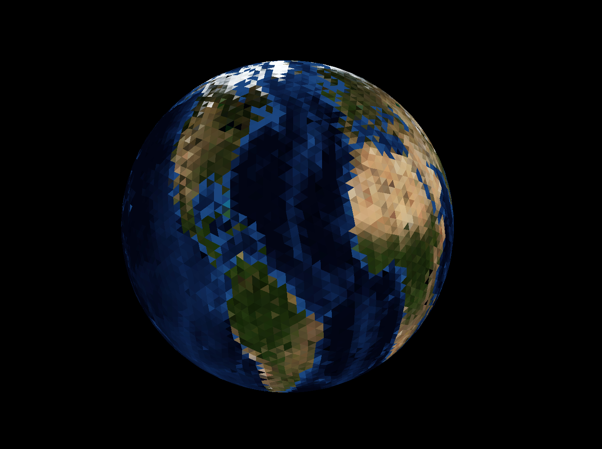
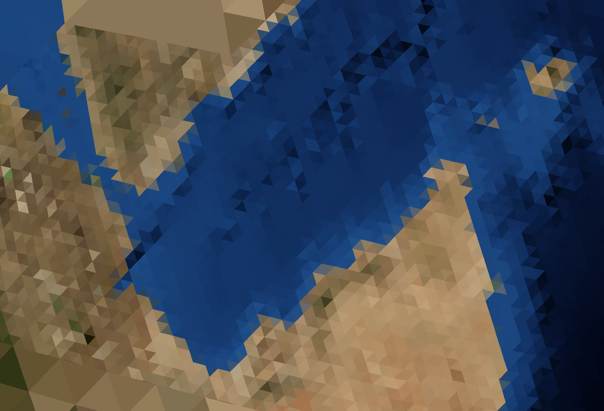

# Java Swing 3D Earth Renderer
A simple 3D renderer written in Java Swing
#
__To Run:__
- javac MapGraphics.java
- Easier, just execute the packaged JavaSwing3DRenderer.jar file included
#

#
## Rendering Method
I use the traditional method of vertex/triangle indexed data which is then transformed into screen coordinates. The g.drawPolygon() function is called per on-screen triangle. As you can expect, there cannot be any z-buffer sorting, texture mapping or shaders with this implementation. To solve sorting, I use a simple version of the painter's algorithm, and all coloring is done on a per-triangle basis.
## Earth Rendering
The earth is composed of an Icosphere that is repeatedly subdivided into a number of TesselationTri objects. These triangles have the option to tesselate recursively, and to reverse the process as well. This tesselation is called by the renderer based on the amount of screen space that is taken up by the triangle.
## Earth Texture Projection
Here, I am using the simple lat/lng projection from an equirrectangular image onto the 3D surface. There is a high degree of distortion here, as can be seen. This could be greatly improved.